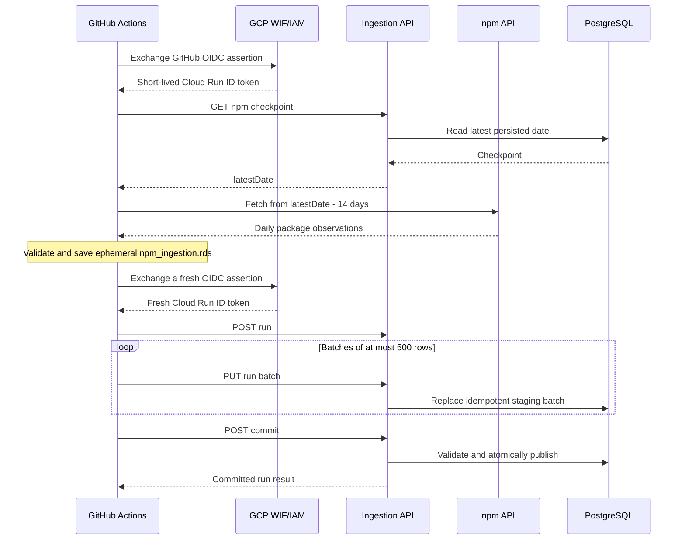
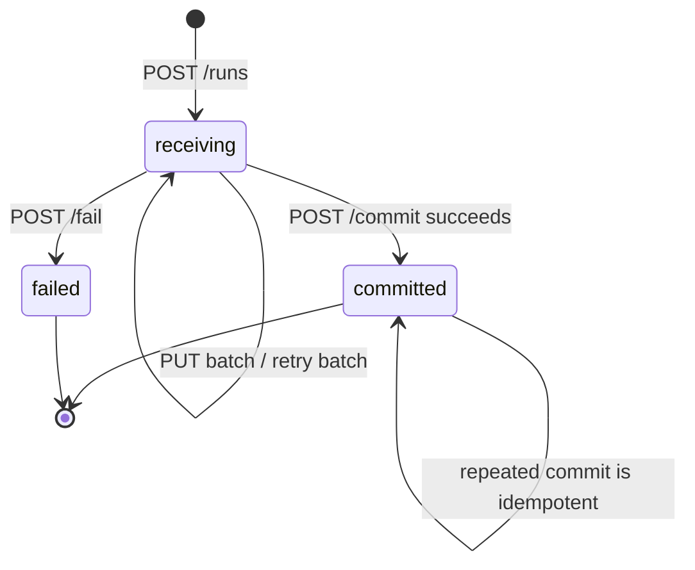
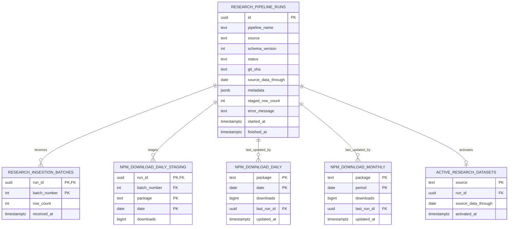

# Scheduled research ingestion architecture

This document records the persistence and scheduling design for the framework-popularity
research pipeline. It is both an implementation guide and the operational runbook.

## Decision record

- PostgreSQL, initially Neon, is the durable system of record for scheduled research data.
- GitHub Actions runs collectors and forecasting jobs.
- Jobs never receive database credentials. They use an authenticated ingestion HTTP API.
- GCP Workload Identity Federation exchanges GitHub OIDC assertions for short-lived Google
  credentials. No service-account JSON key is created or stored in GitHub.
- A private Cloud Run service exposes ingestion routes and owns database write credentials.
- The public Cloud Run web service is built from a separate application artifact and has no
  ingestion routes in its runtime bundle.
- The repository is a pnpm workspace monorepo. Deployable services share versioned contracts and
  a Drizzle ORM database package without sharing entry points or container images.
- Drizzle's TypeScript schema is the database source of truth; generated SQL migrations are kept
  in version control and applied by the ingestion service during startup.
- npm downloads are the first migrated source. Google Trends, GitHub snapshots, and forecasts
  remain archived-file inputs until their later migrations.

## Components

```mermaid
flowchart LR
  GH[GitHub Actions<br/>scheduled npm job]
  OIDC[GitHub OIDC issuer]
  WIF[GCP Workload<br/>Identity Federation]
  SA[github-research-ingestor<br/>service account]
  ING[Private Cloud Run<br/>ingestion service]
  DB[(PostgreSQL / Neon)]
  WEB[Public Cloud Run<br/>Analog web service]
  USER[Dashboard user]

  GH -->|requests assertion| OIDC
  GH -->|presents assertion| WIF
  WIF -->|short-lived impersonation| SA
  GH -->|Cloud Run ID token + JSON batches| ING
  SA -. IAM run.invoker .-> ING
  ING -->|owner/write connection| DB
  WEB -->|read-only connection| DB
  USER --> WEB
```

The public web and private ingestion service are independently built artifacts. Cloud Run IAM
provides the network authentication layer for the private deployment, and the web artifact does
not contain the ingestion HTTP server.

## Monorepo boundaries

```text
apps/ingestion-api/                 private Node HTTP service and transport mapping
packages/ingestion-contracts/       versioned payload schemas and validation
packages/research-database/         Drizzle schema, migrations, reads, and ingestion transactions
src/                                public Analog web application
research/framework-popularity/      R collectors and forecasting pipeline
Dockerfile                          public web image
Dockerfile.ingestion                private writer image
```

The web application remains at the workspace root in this migration to avoid an unnecessary move
of every Angular file. It is still the `@github-statistics/web` workspace package. The deployment
boundary is complete: `apps/ingestion-api` has its own package, entry point, dependency graph,
tests, and image. A later move from `src/` to `apps/web/` would be organizational only.

## npm scheduled workflow

The implemented workflow is `.github/workflows/ingest-npm-downloads.yml`. It runs at 06:17 UTC
on the sixth day of each month and can also be started manually.



The second authentication is intentional. Cloud Run ID tokens are short-lived and may expire
while source data is being collected. The ephemeral RDS file exists only inside the Actions
runner and is ignored by Git; it is a step handoff, not persistent storage.

### Collection rules

- Packages are exactly `react`, `@angular/core`, and `vue`.
- The first run starts at `2015-01-01`.
- Later runs refetch a 14-day overlap to capture upstream corrections.
- Missing dates are represented as zero downloads.
- Source data ends at yesterday; the current day is never ingested.
- Monthly dashboard rows are published only for completed calendar months.
- Every package must have the same continuous staged date interval before commit succeeds.

## Authentication and trust

### Trust chain

1. The workflow declares `id-token: write`. This only permits that job to request a GitHub OIDC
   assertion; it does not grant repository write access.
2. A GCP Workload Identity Provider trusts GitHub's issuer and maps repository claims.
3. Its attribute condition admits only `AlexVeretrnkin/github-statistics-analog-js` on `main`.
4. That principal may impersonate one dedicated service account using
   `roles/iam.workloadIdentityUser`.
5. The service account has only `roles/run.invoker` on the private ingestion Cloud Run service.
6. `google-github-actions/auth` generates an ID token whose audience is the ingestion service URL.
7. Cloud Run validates the token before the request reaches the application.

No `gcloud iam service-accounts keys create` command is needed. The Workload Identity Provider
resource name and service-account email are identifiers, not credentials.

### Required GitHub repository variables

Configure these under **Settings -> Secrets and variables -> Actions -> Variables**:

| Variable | Value |
| --- | --- |
| `GCP_WORKLOAD_IDENTITY_PROVIDER` | Full provider resource name using the project number |
| `GCP_INGESTION_SERVICE_ACCOUNT` | Dedicated service-account email |
| `GCP_INGESTION_AUDIENCE` | Exact private Cloud Run service URL |
| `GCP_INGESTION_URL` | Private Cloud Run service URL, without a trailing slash |

None of these values needs to be a GitHub secret. The npm API is public, so this workflow has no
long-lived secret.

### GCP setup outline

Use project-specific values for the placeholders:

```bash
gcloud services enable \
  iam.googleapis.com \
  iamcredentials.googleapis.com \
  sts.googleapis.com \
  run.googleapis.com

gcloud iam service-accounts create github-research-ingestor \
  --display-name="GitHub research ingestion"

gcloud iam service-accounts create github-ingestion-runtime \
  --display-name="Research ingestion Cloud Run runtime"

gcloud iam workload-identity-pools create github-actions \
  --location=global \
  --display-name="GitHub Actions"

gcloud iam workload-identity-pools providers create-oidc github-statistics \
  --location=global \
  --workload-identity-pool=github-actions \
  --issuer-uri=https://token.actions.githubusercontent.com \
  --attribute-mapping="google.subject=assertion.sub,attribute.repository=assertion.repository,attribute.ref=assertion.ref" \
  --attribute-condition="assertion.repository == 'AlexVeretrnkin/github-statistics-analog-js' && assertion.ref == 'refs/heads/main'"
```

Then grant the repository principal `roles/iam.workloadIdentityUser` on the service account and
grant that service account `roles/run.invoker` on the ingestion service. Use the project number,
not the project ID, inside `principalSet` resource names.

```bash
gcloud iam service-accounts add-iam-policy-binding \
  github-research-ingestor@PROJECT_ID.iam.gserviceaccount.com \
  --role=roles/iam.workloadIdentityUser \
  --member="principalSet://iam.googleapis.com/projects/PROJECT_NUMBER/locations/global/workloadIdentityPools/github-actions/attribute.repository/AlexVeretrnkin/github-statistics-analog-js"

gcloud run services add-iam-policy-binding INGESTION_SERVICE \
  --region=REGION \
  --role=roles/run.invoker \
  --member="serviceAccount:github-research-ingestor@PROJECT_ID.iam.gserviceaccount.com"
```

The two service accounts are deliberately different. `github-research-ingestor` can invoke the
service but cannot read secrets. `github-ingestion-runtime` runs the container and receives access
only to the ingestion database secret:

```bash
gcloud secrets add-iam-policy-binding neon-database-url-ingestion \
  --project=PROJECT_ID \
  --role=roles/secretmanager.secretAccessor \
  --member="serviceAccount:github-ingestion-runtime@PROJECT_ID.iam.gserviceaccount.com"
```

### Build and deploy the private artifact

The repository includes a dedicated Cloud Build definition so the private image is built from
`Dockerfile.ingestion`, never from the public `Dockerfile`:

```bash
INGESTION_IMAGE="REGION-docker.pkg.dev/PROJECT_ID/REPOSITORY/github-statistics-ingestion:latest"

gcloud builds submit . \
  --project=PROJECT_ID \
  --config=cloudbuild.ingestion.yaml \
  --substitutions="_IMAGE=${INGESTION_IMAGE}"

gcloud run deploy github-statistics-ingestion \
  --project=PROJECT_ID \
  --region=REGION \
  --image="${INGESTION_IMAGE}" \
  --service-account="github-ingestion-runtime@PROJECT_ID.iam.gserviceaccount.com" \
  --set-secrets="DATABASE_URL=neon-database-url-ingestion:latest" \
  --no-allow-unauthenticated
```

For the current GCP layout, `PROJECT_ID` is `uni-rnd`, `REGION` is `europe-west1`, and the
existing Artifact Registry repository is `cloud-run-source-deploy`.

## Configuration reference

### Public web variables

| Variable | Meaning |
| --- | --- |
| `DATABASE_URL` | Read-only PostgreSQL connection URL |
| `FRAMEWORK_RESEARCH_DB_READS` | Replaces archived observed npm series with PostgreSQL rows when `true` |

### Private ingestion variables

| Variable | Meaning |
| --- | --- |
| `DATABASE_URL` | Direct PostgreSQL URL with migration and ingestion write privileges |
| `PORT` | HTTP port; Cloud Run supplies `8080` |

### npm job variables

| Variable | Default | Meaning |
| --- | --- | --- |
| `RESEARCH_NPM_START` | `2015-01-01` | Required beginning of the first bootstrap |
| `RESEARCH_NPM_LATEST_DATE` | empty | Checkpoint returned by the server |
| `RESEARCH_NPM_OVERLAP_DAYS` | `14` | Correction overlap on later collections |
| `RESEARCH_NPM_INGESTION_FILE` | `out/npm_ingestion.rds` | Ephemeral collector/publisher handoff |
| `RESEARCH_INGESTION_BATCH_SIZE` | `500` | Rows per PUT request; maximum 1,000 |
| `RESEARCH_INGESTION_URL` | none | Private Cloud Run base URL |
| `RESEARCH_INGESTION_TOKEN` | none | Fresh Cloud Run ID token |

`RESEARCH_TODAY` is a deterministic test override. Production leaves it unset.

## HTTP ingestion contract

All routes are under `/api/internal/v1/ingestions/npm-downloads`.

| Method and route | Purpose |
| --- | --- |
| `GET /checkpoint` | Return the latest durable day, completed month, and active run |
| `POST /runs` | Create a receiving run and return its UUID |
| `PUT /runs/:runId/batches/:batchNumber` | Idempotently replace one staging batch |
| `POST /runs/:runId/commit` | Validate and atomically publish a complete run |
| `POST /runs/:runId/fail` | Record a terminal publisher failure |

The current contract version is `schemaVersion: 1`. A batch contains 1–1,000 rows:

```json
{
  "rows": [
    {
      "package": "react",
      "date": "2026-08-18",
      "downloads": 12345678
    }
  ]
}
```

Validation is performed at both levels:

- Request validation rejects unknown packages, malformed dates, negative/non-integer values,
  oversized batches, and invalid run identifiers.
- Commit validation requires all three packages, continuous dates, identical start dates, and a
  maximum date equal to `sourceDataThrough`.

## Run state machine



- A batch number is a stable idempotency key within a run.
- Repeating the same `PUT` replaces that batch transactionally.
- Uploading the same package/date in a different batch is a conflict.
- A committed or failed run cannot accept more batches.
- Commit takes a PostgreSQL advisory transaction lock, so two npm datasets cannot publish at once.
- Failed validation leaves canonical tables and the active dataset unchanged.

## PostgreSQL schema and Drizzle ORM

The typed schema is `packages/research-database/src/schema.ts`. Drizzle Kit generates versioned
migrations in `packages/research-database/drizzle/`; never use `drizzle-kit push` against
production. The private ingestion service applies pending migrations before opening its HTTP
listener, so a revision cannot become ready with an incompatible database schema.

Normal reads, writes, deletes, aggregates, and upserts use Drizzle's typed query APIs. Small SQL
expressions remain only where PostgreSQL-specific behavior is required, notably the advisory
transaction lock and calendar-month date expressions.



Drizzle records applied migrations in its `drizzle.__drizzle_migrations` table.

### Atomic commit algorithm

One database transaction performs the following:

1. Lock the npm publishing key and the selected run.
2. Validate staged package/date coverage.
3. Delete only the canonical overlap interval.
4. Insert staged daily observations into the canonical daily table.
5. Recompute completed-month aggregates from canonical daily history.
6. Update `active_research_datasets`.
7. Mark the run committed.

Readers therefore see either the previous complete dataset or the new complete dataset, never a
partially uploaded result.

## Cloud Run deployments

Build and deploy two images from the same repository:

| Setting | Public web service | Private ingestion service |
| --- | --- | --- |
| Dockerfile | `Dockerfile` | `Dockerfile.ingestion` |
| Application | `@github-statistics/web` | `@github-statistics/ingestion-api` |
| Unauthenticated invocation | Allowed | Disabled |
| `FRAMEWORK_RESEARCH_DB_READS` | `true` after first ingestion | Not present |
| `DATABASE_URL` | Read-only PostgreSQL role | Migration/ingestion owner role |
| IAM invoker | Public | `github-research-ingestor` only |

Keep both database URLs in GCP Secret Manager and expose each only to its corresponding service.
Do not put either URL in GitHub.

The public image contains no ingestion route implementation. The private service is protected by
Cloud Run IAM and responds only to `/healthz` and the versioned ingestion contract.

### Read-only database role

After the ingestion migration has created the tables, create a separate login for the public app.
Use a generated password and adapt the schema/database names if needed:

```sql
CREATE ROLE framework_web_reader LOGIN PASSWORD 'generated-password';
GRANT CONNECT ON DATABASE neondb TO framework_web_reader;
GRANT USAGE ON SCHEMA public TO framework_web_reader;
GRANT SELECT ON npm_download_monthly, active_research_datasets
  TO framework_web_reader;
```

The web code queries only `npm_download_monthly` in this iteration.

Future migrations that introduce additional public read tables must grant those tables to the
reader role explicitly.

## Application read behavior

`FRAMEWORK_RESEARCH_DB_READS=false` keeps the existing archived CSV reader. When it is `true` and
npm rows exist, the observed npm series comes from PostgreSQL. Google Trends, GitHub stars,
diagnostics, and all forecasts still come from archived research files in iteration one.

Recommended rollout:

1. Build `Dockerfile.ingestion` and deploy it as the private ingestion service.
2. Run `Ingest npm downloads` manually and confirm a committed run.
3. Compare PostgreSQL monthly values with the archived CSV dashboard.
4. Deploy the public service with `FRAMEWORK_RESEARCH_DB_READS=true` and the read-only URL.
5. Leave the legacy CSV workflow manual-only as a rollback tool.

## Failure handling and operations

- Network/API requests use retries and timeouts in the collector.
- GitHub Actions concurrency prevents overlapping npm workflows.
- A publisher error after run creation attempts to mark the run failed.
- A runner terminated before `/fail` can leave a receiving run; it is harmless because only a
  successful commit affects canonical data. A later cleanup job can expire abandoned runs.
- The 14-day overlap makes ordinary reruns safe and captures npm corrections.
- GitHub run ID, attempt, commit SHA, fetched-from date, counts, and timestamps are retained for
  auditability.
- Do not log OIDC or Cloud Run ID tokens.

Useful operational queries:

```sql
SELECT id, status, source_data_through, staged_row_count, started_at, finished_at, error_message
FROM research_pipeline_runs
WHERE source = 'npm-downloads'
ORDER BY started_at DESC
LIMIT 20;

SELECT package, min(date), max(date), count(*)
FROM npm_download_daily
GROUP BY package
ORDER BY package;

SELECT * FROM active_research_datasets WHERE source = 'npm-downloads';
```

## Verification commands

```bash
pnpm test
pnpm build:all
pnpm --filter @github-statistics/research-database db:check
Rscript -e "parse(file='research/framework-popularity/jobs/collect_npm_ingestion.R')"
Rscript -e "parse(file='research/framework-popularity/jobs/publish_npm_ingestion.R')"
```

### Full local environment

Local testing uses `compose.yaml` and `.env.local`; it does not reuse the Neon URL or any GCP
identity. The Compose network contains PostgreSQL, the dedicated ingestion image, and the public
web image. Host ports are bound to `127.0.0.1`.

Two modes are supported:

1. `pnpm local:dev` runs PostgreSQL in Docker and both Node services natively for fast iteration.
2. `pnpm local:up` builds and runs both production images plus PostgreSQL for container parity.

After either mode is ready, `pnpm local:smoke` performs the complete contract flow: checkpoint,
run creation, batch upload, atomic commit, checkpoint verification, and public dashboard request.
It uses deterministic January 2015 data on an empty database and a deterministic 14-day overlap
on subsequent executions.

`pnpm local:pipeline:npm` is the slower external-integration check. It reads the local checkpoint,
runs the real R npm collector, and publishes the handoff to the local API. Its explicit
`RESEARCH_INGESTION_ALLOW_UNAUTHENTICATED=true` setting is accepted only by the publisher script;
the scheduled GitHub workflow does not set it. Production remains protected by Cloud Run IAM.
During an initial backfill, npm can omit leading dates from before a package existed; the collector
stores those dates as zeroes to preserve the original archive convention. It still requires
continuous coverage after the first observation and coverage through the latest requested date.

```bash
cp .env.local.example .env.local
pnpm local:dev          # terminal 1
pnpm local:smoke        # terminal 2
pnpm local:pipeline:npm # optional real npm API run
pnpm local:compare:npm  # compare DB rows with the archived CSV baseline
pnpm local:down
```

`pnpm local:reset` performs `docker compose down --volumes` and deletes all local database/cache
state. It is intentionally separate from the normal stop command.

### Archived-data reconciliation

`pnpm local:compare:npm` is a read-only quality check between the canonical PostgreSQL tables and
the original outputs in `research/framework-popularity/out/npm_downloads_daily.csv` and
`npm_downloads_monthly.csv`. For each package and granularity it reports:

- archived, database, and common coverage;
- exact matches and value mismatches;
- missing and extra keys inside the common coverage range;
- the largest absolute difference and representative examples.

Later database dates and earlier archived dates are not failures because the two datasets can have
different collection boundaries. `pnpm local:compare:npm:strict` applies the same range rule but
returns a non-zero status for any difference within that range or when no common range exists,
which makes it suitable for CI or an explicit acceptance check. The underlying command also
accepts `--json` for machine-readable output:

```bash
pnpm run build:packages
node tools/compare-npm-data.mjs --json
```

For a clean end-to-end comparison, reset the disposable local database, start the stack, run
`pnpm local:pipeline:npm`, and then run the comparison. Do not run `pnpm local:smoke` first: its
deterministic synthetic rows intentionally differ from the historical npm archive. A mismatch can
also represent a correction to source data—for example, a zero captured by the old script may be
replaced by a non-zero value returned by npm during the new run—so inspect the examples before
treating every strict failure as a pipeline regression.

The PostgreSQL integration test is opt-in because it mutates its configured database. Run it only
against a disposable database:

```bash
RUN_DATABASE_INTEGRATION_TESTS=true \
DATABASE_URL=postgresql://... \
pnpm exec vitest run --config vitest.node.config.ts \
  packages/research-database/src/npm-ingestion.integration.spec.ts
```

When the Drizzle schema changes, generate and inspect a migration before committing it:

```bash
pnpm --filter @github-statistics/research-database db:generate
pnpm --filter @github-statistics/research-database db:check
```

## Migration roadmap

### Iteration 1: npm downloads — implemented

- Versioned batch ingestion API.
- PostgreSQL daily and monthly npm storage.
- Checkpoint-based overlap collection.
- GitHub Actions OIDC authentication.
- Database-backed observed npm dashboard series.

### Iteration 2: forecasting

- Add a private forecast-input endpoint backed by normalized database series.
- Run ARIMA, ETS, and Prophet without durable CSV inputs.
- Add versioned forecast staging/canonical tables and commit validation.
- Switch npm forecasts in the dashboard to database reads.

### Iteration 3: Google Trends

- Replace the entire rolling five-year window as one versioned dataset.
- Preserve the normalization request metadata and category.
- Activate only after range and value validation.

### Iteration 4: GitHub repository snapshots

- Store every observation rather than overwriting one row per month.
- Derive monthly net growth in SQL or a transformation job.
- Add tracked repositories and repository issue/label snapshots.

### Iteration 5: remove production CSV persistence

- Remove generated CSV outputs from scheduled workflows and the runtime image.
- Retain small test fixtures and optional explicit export commands only.
- Keep source provenance and pipeline-run metadata in PostgreSQL.
